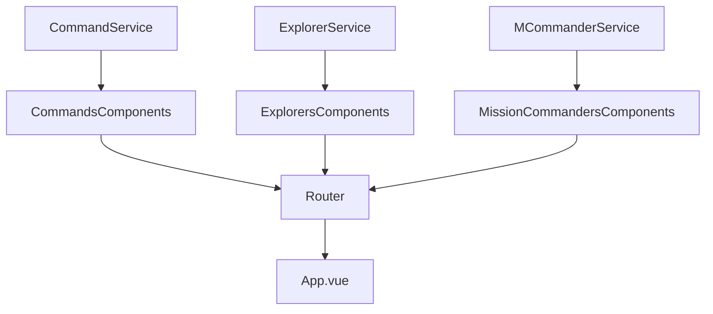
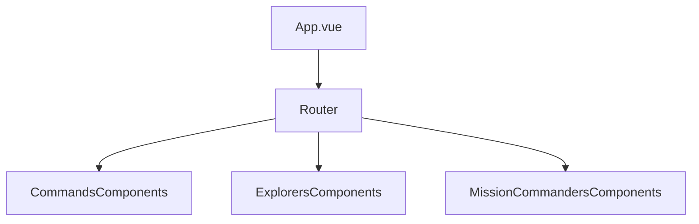
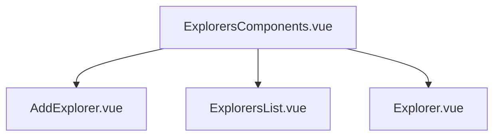
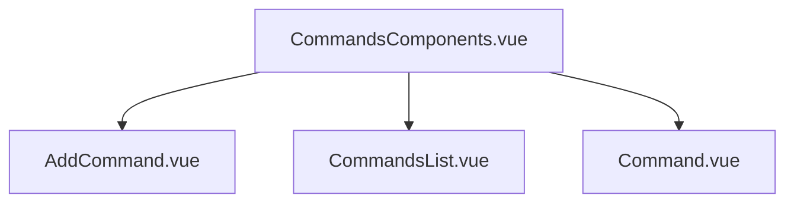
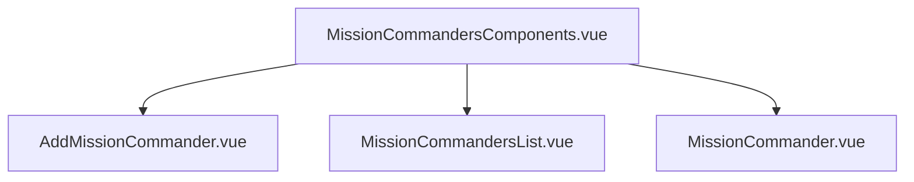

# Vue Client - CRUD whit this [server](https://github.com/martinGM05/PrismaDB)

> This is the exercise from LaunchX of the week 5.

## Some libraries were used in this project:
- [Axios](https://www.npmjs.com/package/axios)
- [Boostrap](https://getbootstrap.com/)

If you want to download the project don't forget to run **`npm i`** to install the necessary dependencies.
If you want to run the project, just run **`npm run serve`**

## The logic distribution of this api is like this

##  What are the templates of the components?
The templates are the html files that are used to create the components.

## What are the services?
The services are the files that are used to create the logic of the project.

## What are the routes?
The routes are the files that are used to create the routes of the project.

## Routes of the project
The principal file is **`App.vue`**, where the router is.

If we go to Explorers, we had to go to **`ExplorersComponents.vue`** because it is the component that is responsible for the explorers.

If we go to Commands, we had to go to **`CommandsComponents.vue`** because it is the component that is responsible for the commands.

If we go to MissionCommanders, we had to go to **`MissionCommandersComponents.vue`** because it is the component that is responsible for the mission commanders.

## These are the files of the project:
| Component | Path |
| --- | --- |
| **`AddExplorer.vue`** | **`src/components/Explorers/AddExplorer.vue`** |
| **`AddCommand.vue`** | **`src/components/Commands/AddCommand.vue`** |
| **`AddMissionCommander.vue`** | **`src/components/MissionCommanders/AddMissionCommander.vue`** |
| **`ExplorersList.vue`** | **`src/components/Explorers/ExplorersList.vue`** |
| **`CommandsList.vue`** | **`src/components/Commands/CommandsList.vue`** |
| **`MissionCommandersList.vue`** | **`src/components/MissionCommanders/MissionCommandersList.vue`** |
| **`Explorer.vue`** | **`src/components/Explorers/Explorer.vue`** |
| **`Command.vue`** | **`src/components/Commands/Command.vue`** |
| **`MissionCommander.vue`** | **`src/components/MissionCommanders/MissionCommander.vue`** |
| **`Router`** | **`src/router.js`** |
| **`App.vue`** | **`src/App.vue`** |