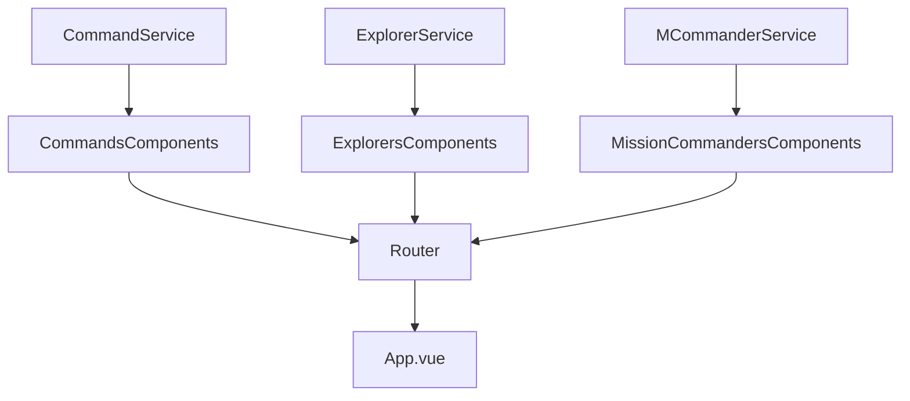

# Vue Client - CRUD whit this [server](https://github.com/martinGM05/PrismaDB)

> This is the exercise from LaunchX of the week 5.

## Some libraries were used in this project:
- [Axios](https://www.npmjs.com/package/axios)
- [Boostrap](https://getbootstrap.com/)

If you want to download the project don't forget to run **`npm i`** to install the necessary dependencies.
If you want to run the project, just run **`npm run serve`**

## The logic distribution of this api is like this


## Services
### CommandService:
```javascript
class CommandersService {
  getAll() {
    return http.get("/commanders");
  }
  get(id) {
    return http.get(`/commanders/${id}`);
  }
  create(data) {
    return http.post("/commanders", data);
  }
  update(id, data) {
    return http.put(`/commanders/${id}`, data);
  }
  delete(id) {
    return http.delete(`/commanders/${id}`);
  }
}
```